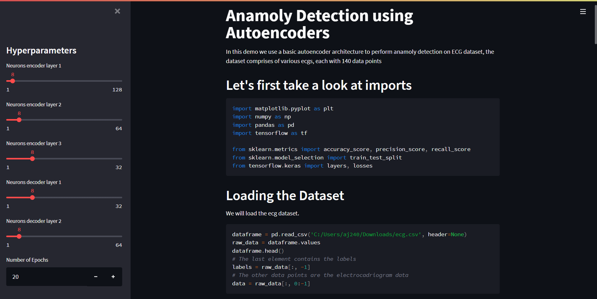
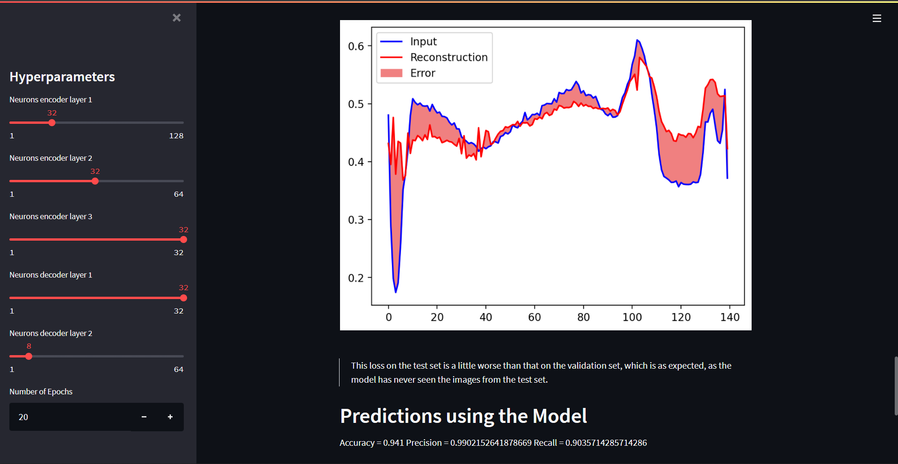
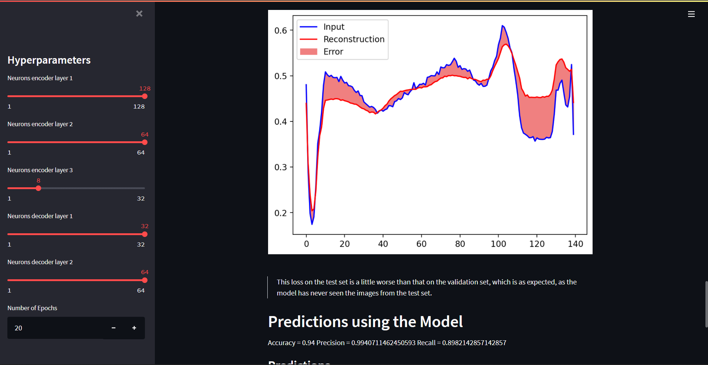

<h1> Anamoly Detection using Autoencoders</h1>
<h3>Streamlit Implementation</h3>
<h4 align= right> Python, Streamlit, Tensorflow</h4>
 

A basic implementation of an autoencoder using tensorflow 
trained and tested on an ECG dataset,
webapp created using streamlit which provides flexibility in choosing the number of nodes in the different layers of endcoder and decoder.

 

<figure class="video_container">
  <video controls="true" allowfullscreen="true" poster="images/ss1.png">
    <source src="video/record.webm" type="video/webm">
  </video>
</figure>